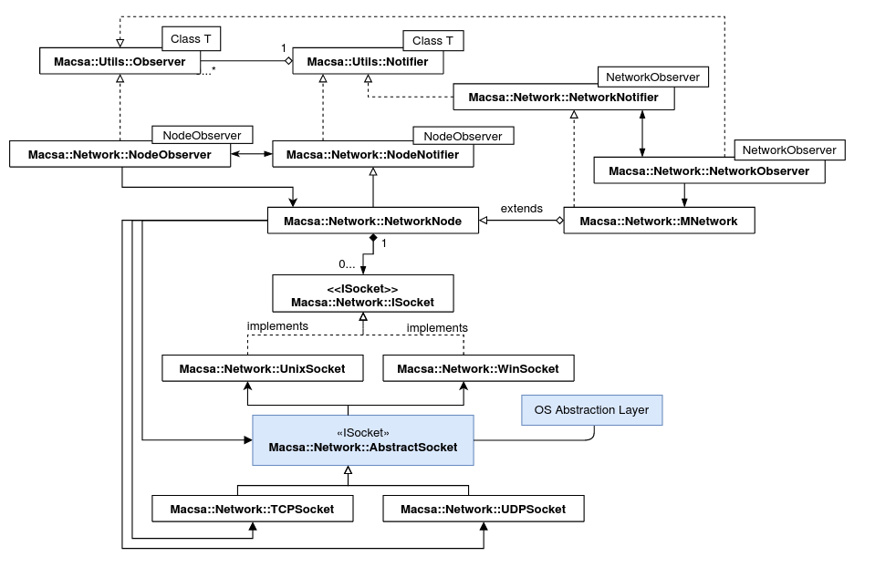

# MNetwork
## Overview
La Librería MNetwork ofrece la posibilidad de generar redes de dispositivos con comunicaciones a través de sockets de red.

## UML Simplificado

## Clases

### ISocket
Isocket es una interfaz que define la implementación de los sockets de comunicaciones

### NetworkNode
NetworkNode es la clase con mas interés en esta librería. Los nodos de la red estan compuestos por uno o varios sockets de tipo TCP o UDP por el que es posible enviar y recibir tramas de comunicaciones. A su vez, estos nodos pueden ser de tipo servidor, inicializando socket y aceptando nuevas conexiones. Dichas conexiones serán la raíz de un nuevo nodo.

### MNetwork

MNetwork expande la clase NetworkNode. Creando una fachada para inicializar sockets servidores de manera mas sencialla y manteniendo una lista de los nodos de la red.

