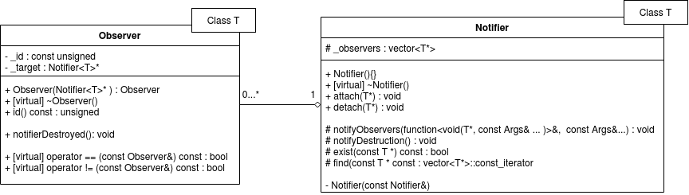

## The Notifier-Observer classes
### Overview
In the MVC pattern the View usually has to be updated when controller notifies this creates a strong relationship with this kind of classes.

### UML

 